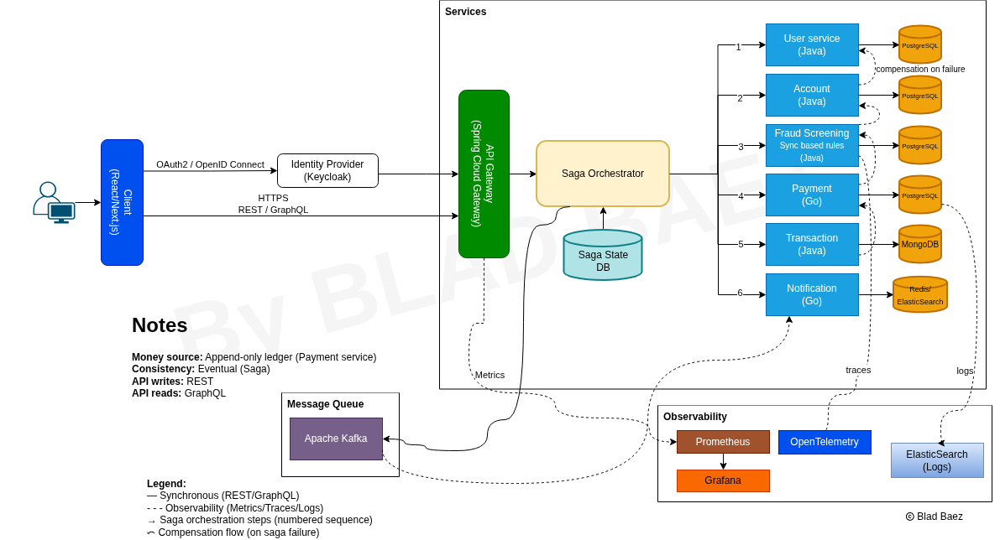

# DemoBank
#### by BLAD

## Description
Event-driven banking application, for demo purposes using the Saga pattern, 
Spring Boot microservices, Kafka, OpenTelemetry tracing, Docker and Terraform.

## Architecture

## Clone the repository
1. Using the terminal, go to the folder or directory for the project.
2. In the terminal, include the following command: \
   `git clone https://github.com/blad90/demo-banking-app.git`
3. Inside project root folder, in order to set up and build the containers, run the below command: \
   `docker-compose up -d`

## Endpoints
- API Gateway: `/8080`
- Users: `/8081/users`
- Accounts: `/8082/accounts`
- Transactions: `/8083/transactions`

## Extras
### For rebuilding docker containers
- `docker build -f services/[NAME]-service/Dockerfile -t [NAME]-service:latest .`
- `docker compose build --no-cache [NAME]-service`
- `docker compose up [NAME]-service`

### Using minikube (Kubernetes)
- To start minikube, use the command: `minikube start --driver=docker` 
- To stop minikube, use the command: `minikube stop`
- To apply any changes in deployment config: `kubectl apply -f infrastructure/kubernetes/base/[SERVICE_NAME]/deployment.yaml`
- To apply any changes in service config: `kubectl apply -f infrastructure/kubernetes/base/[SERVICE_NAME]/service.yaml`
- To check nodes running: `kubectl get nodes`
- To verify cluter IP's: `kubectl get svc`
- For removing a pod: `kubectl delete pod [NAME]`
- For deleting a deployment: `kubectl delete deployment [NAME]`
- For restarting : `kubectl rollout restart deployment/[NAME]-service`
- For checking logs: `kubectl logs -f deploy/[NAME]`

### Databases
- At the beginning, in order to create the database for each service, run: \
  `kubectl create configmap postgres-init-db --from-file=infrastructure/docker/postgres/init-db.sql`
- For accessing postgres container: \
  `docker exec -it postgres bash` then `psql -U postgres`

### Other commands
- For running each service outside any IDE using development profile: \
  `java -Xms64m -Xmx256m -jar [SERVICE_NAME].jar --spring.profiles.active=dev`
  - To point the terminal to the Docker engine inside minikube for building images for microservices locally: \
  `eval $(minikube docker-env)`
  - To enable Headlamp for pods monitoring in Kubernetes, directly from official site:\
  - `kubectl apply -f https://raw.githubusercontent.com/kubernetes-sigs/headlamp/main/kubernetes-headlamp.yaml`

## License
Licensed under the Apache License, Version 2.0. See [LICENSE](LICENSE) for details.
